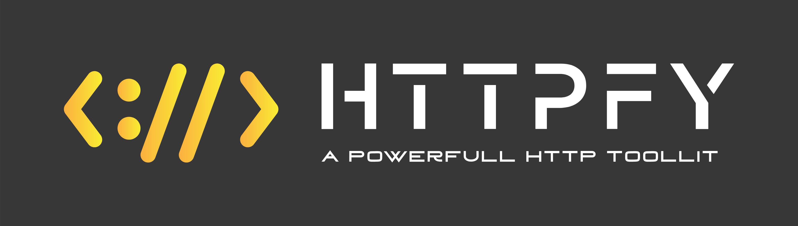

<div id="top"></div>

<br />
<div align="center">
  <a href="https://github.com/devxprite/httpfy">
    
  </a>

  <p align="center">
    A Incredible fast and Powerful HTTP toolkit
    <br>
    <br>
    
    
    
    <br>
    
    
    <br />
    <a href="https://github.com/devxprite/httpfy/issues">Report Bug</a>
    ·
    <a href="https://github.com/devxprite/httpfy/issues">Request Feature</a>
  </p>
</div>

<!-- GETTING STARTED -->

## Getting Started

  

### Prerequisites


You need **NodeJs** 10 or later to run this tool. You can install NodeJs :

- On Linux
  ```sh
  sudo apt-get install nodejs
  ```
- On Termux
  ```sh
  pkg install nodejs-lts
  ```

## Installation

### Using npm

```bash
npm install -g -s httpfy
```
### Install locally

```bash
git clone https://github.com/devXprite/httpfy.git
cd httpfy
npm install
node index.js -h
```

### Uninstall

```bash
npm remove httpfy -g
```

## Usage


```bash
httpfy -f <filename containing urls>
```

### Options

| Short  | Options             | Type      | Description                                                   |
| ------ | ------------------- | --------- | ------------------------------------------------------------- |
| -v     | --version           | probe     | output the current version                                    |
| -f     | --file              | string    | input file containing list of URLs                            |
| -sc    | --status-code       | probe     | display response status-code                                  |
| -cl    | --content-length    | probe     | display response content-length                               |
| -ct    | --content-type      | probe     | display response content-type                                 |
| -rt    | --response-time     | probe     | display response time                                         |
| -lc    | --line-count        | probe     | display response body line count                              |
| -wc    | --word-count        | probe     | display response body word count                              |
| -ws    | --web-serve         | probe     | display web server name                                       |
| -rl    | --redirect-location | probe     | display redirect location                                     |
| -m     | --method            | probe     | display http request method                                   |
| -nc    | --no-color          | probe     | disable colors in cli output                                  |
| -ttl   | --title             | probe     | display page title                                            |
| -fl    | --failed            | probe     | display failed request's                                      |
| -nr    | --no-redirect       | probe     | don't follow redirects                                        |
| -mr    | --max-redirect      | number    | maximum redirects to follow                                   |
| -t     | --threads           | number    | maximum cocurrent requests send (default: 100)                |
| -i     | --interval          | number    | interval between each thread in seconds                       |
| -c     | --cookie            | string    | send cookies (--cookie 'login=Yes')                           |
| -H     | --header            | string    | custom http headers to send (--header 'X-MyHeader: XYZ')      |
| -x     | --request-methods   | string    | set request methods use 'all' to probe all HTTP methods       |
| -pc    | --protocol          | string    | set request Protocol (default: "https")                       |
| -path  | --request-path      | string    | path or list of paths  (-path admin,login)                    |
| -param | --request-param     | string    | set request parameters  (-param id=5)                         |
| -ua    | --user-agent        | string    | set custom useragent                                          |
| -time  | --timeout           | number    | set request timeout in seconds                                |
| -mc    | --match-code        | numbers[] | match response with specified status code  (-mc 200,404)      |
| -ml    | --match-length      | numbers[] | match response with specified content length  (-ml 800,900)   |
| -mlc   | --match-line-count  | numbers[] | match response body with specified line count  (-mlc 100,102) |
| -ms    | --match-string      | strings[] | match response with specified strings  (-ms admin)            |
| -o     | --output-file       | string    | save results in a single file  (-o result.txt)                |
| -of    | --output-folder     | string    | save response of url in multiple files  (-of result)          |
| -h     | --help              | probe     | display help for command                                      |

## Examples

### Basic

- ```bash
  httpfy -f urls.txt -sc -ttl -fl
  ```
  
### Try all Http Methods

- ```bash
  httpfy -f urls.txt -sc -m -x all
  ```
  

### File/Path Bruteforce

- ```bash
  httpfy -f urls.txt -path admin,login -sc
  ```
  


<!-- GitPod -->

## Run with Gitpod

Click this button to run your project on Gitpod which comes with pre-configured environment you need.

[](https://gitpod.io/#/https://github.com/devXprite/httpfy)

<!-- CONTRIBUTING -->
## Contributing

Contributions are what make the open source community such an amazing place to learn, inspire, and create. Any contributions you make are **greatly appreciated**.

If you have a suggestion that would make this better, please fork the repo and create a pull request. You can also simply open an issue with the tag "enhancement".
Don't forget to give the project a star! Thanks again!

1. Fork the Project
2. Create your Branch 
3. Commit your Changes 
4. Push to the Branch 
5. Open a Pull Request
 
## Supporters

### Stargazers:
[](https://github.com/devXprite/httpfy/stargazers)  

### Forkers
[](https://github.com/devXprite/httpfy/network/members)


## License

Distributed under the GPL-3.0 license. See `LICENSE.txt` for more information.
