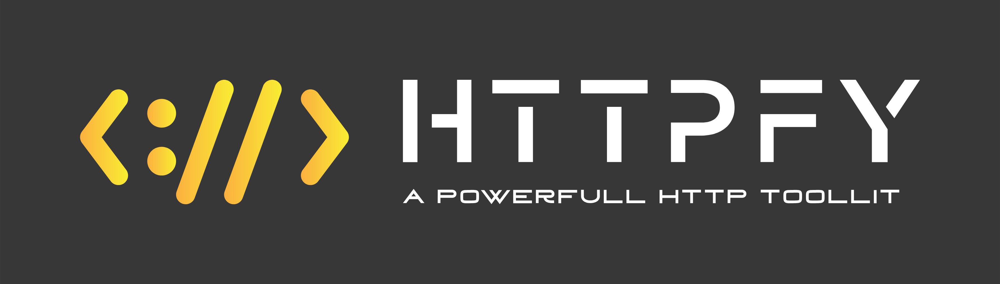

<div id="top"></div>

> HTTPFY curently in beta so you may see problems. Please open a Issue on GitHub and report them!

<br />
<div align="center">
  <a href="https://github.com/devxprite/httpfy">
    
  </a>

  <p align="center">
    A Incredible fast and Powerful HTTP toolkit
    <br>
    <br>
    
    
    
    <br>
    
    
    
        
    <!--
    <a href="https://github.com/github_username/repo_name"><strong>Explore the docs »</strong></a> -->
    <br />
    <a href="https://github.com/github_username/repo_name">View Demo</a>
    ·
    <a href="https://github.com/github_username/repo_name/issues">Report Bug</a>
    ·
    <a href="https://github.com/github_username/repo_name/issues">Request Feature</a>
  </p>
</div>

<!-- GETTING STARTED -->

## Getting Started


### Prerequisites

You need to install Node.js first, then install the tool globally.
- NodeJs 10.24.1 or later
- NPM 6.14.12 or later

## Installation

### Global

#### npm

```bash
npm install -g -s httpfy
```

#### yarn

```bash
yarn global add httpfy
```

#### npx

```bash
npx httpfy -f <file>
```

### Local

```bash
git clone https://github.com/devXprite/httpfy.git
cd httpfy
npm install
node index.js -h
```

### Uninstall

```bash
npm remove httpfy -g
```

## Usage

```bash
httpfy -f <filename containing urls>
```
